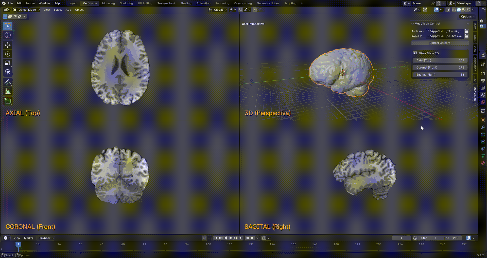

# Research_Blender_MedVisor

MedVision es un add-on para Blender (v3.6+) que automatiza la segmentación y visualización avanzada de Resonancias Magnéticas (MRI). En un solo clic, la herramienta aísla el cerebro mediante una Inteligencia Artificial de terceros llamada HD-Bet, clasifica sus tejidos anatómicos y genera un entorno clínico interactivo: una malla 3D sincronizada con visores ortogonales 2D que superponen la segmentación anatómica en tiempo real.

## Prerrequisitos del Sistema

Este add-on utiliza una arquitectura de procesamiento híbrida. Dado que Blender opera en Windows pero las herramientas neurocientíficas más robustas son nativas de entornos UNIX, MedVision actúa como puente entre ambos sistemas. Se necesita:

1. HD-BET (Windows): La IA encargada de la extracción craneal (skull-stripping)
2. WSL (Windows Subsystem for Linux): El subsistema integrado de Windows. Actúa como puente para que Blender pueda ejecutar comandos nativos de Linux de forma transparente.
3. Librería FSL (Linux / WSL): El motor estadístico utilizado para segmentar los tejidos.

### Dependencias de Python e IA:
Para que HD-BET funcione correctamente, es requisito indispensable contar con **PyTorch**. Ten en cuenta que estas librerías de IA suelen ir un paso por detrás del desarrollo de software general, por lo que **no admiten las versiones más recientes de Python**. Asegúrate de instalarlo utilizando una versión de Python compatible y estable.

1. Instala la herramienta ejecutando: `pip install hd-bet` (asegurándote de tener PyTorch configurado previamente) o siguiendo las instrucciones de su repositorio oficial.
2. Anota la ruta completa donde se encuentra el ejecutable `hd-bet` (ej. `C:\Ruta\A\Tu\Python\Scripts\hd-bet.exe`).

> **Nota:** Si dispones de una GPU compatible con PyTorch (mediante CUDA), el procesamiento tardará menos. En caso de usar CPU, el proceso puede tardar unos minutos. Para más detalles, consulta el [repositorio oficial de HD-BET](https://github.com/MIC-DKFZ/hd-bet).

## Instalación del Addon en Blender

*Importante: Este addon ha sido desarrollado y validado para funcionar a partir de la versión **3.6** de Blender.*

1. Descarga el código de este repositorio como un archivo `.zip`.
2. Abre Blender.
3. Dirígete a **Edit > Preferences > Add-ons**.
4. Haz clic en **Install...** y selecciona el archivo `.zip`.
5. Activa la casilla `3D View: MedVision` para habilitarlo.

## Uso del Addon

Una vez activado, el addon configurará el entorno automáticamente:

1. El sistema creará un espacio de trabajo (*Workspace*) dedicado llamado **MedVision**, configurado automáticamente con vista cuádruple (*QuadView*) para análisis clínico simultáneo.
2. En el panel lateral derecho del *Viewport* (tecla `N`), busca la pestaña **MedVision Control**.
3. **Archivo MRI:** Utiliza el selector para elegir tu volumen en formato `.nii.gz`.
4. **Ruta HD-BET:** Indica la ruta completa al ejecutable de `hd-bet` que instalaste en tu sistema.
5. **Extraer Cerebro:** Haz clic en este botón. Blender ejecutará el proceso en segundo plano, segmentará el parénquima cerebral y renderizará la malla tridimensional centrada y orientada automáticamente en el centro de la escena.
6. Utiliza el nuevo selector Capa FSL para alternar interactivamente la visualización entre Materia Gris, Materia Blanca o Líquido Cefalorraquídeo.

## Arquitectura y Funcionamiento Interno

El núcleo de MedVision se divide en un pipeline de procesamiento de datos y un motor de renderizado en tiempo real optimizado para no generar objetos basura en la escena de Blender:

1. **Ingesta y Segmentación:** Al cargar el volumen NIfTI, el addon invoca el ejecutable de `HD-BET` a través de un subproceso asíncrono en segundo plano, aislando el tejido cerebral del cráneo.

2. **Segmentación (FSL vía WSL):** Un comando puente entra a Linux y calcula las Estimaciones de Volumen Parcial (PVE), separando probabilísticamente los tejidos mediante modelos de Markov.

3. **Reconstrucción 3D:** Se aplica el algoritmo de *Marching Cubes* sobre los vóxeles indexados para extraer la superficie cerebral y transformarla en una malla de vértices nativa de Blender.

4. **Renderizado 2D (GPU):** Las lonchas bidimensionales correspondientes a los planos Axial, Coronal y Sagital se extraen de la matriz de NumPy en tiempo real. Mediante el módulo `gpu` de Blender, se inyectan como texturas directamente en el búfer de dibujo de la gráfica (`draw_handler`). 

   * Un lienzo opaco inteligente oculta de forma óptica la geometría 3D en las vistas ortogonales (`TOP`, `FRONT`, `RIGHT`), permitiendo inspeccionar las radiografías limpias y con un HUD de texto superpuesto mientras el modelo 3D permanece visible únicamente en la vista de perspectiva.

## Reconocimientos y Herramientas de Terceros

Este proyecto es posible gracias a la integración y el uso de herramientas especializadas de código abierto dentro de la comunidad científica y médica. Se otorga el correspondiente reconocimiento a:

* **[HD-BET (High-Definition Brain Extraction Tool)](https://github.com/MIC-DKFZ/HD-BET):** Desarrollado por el departamento de *Medical Image Computing* del DKFZ (Centro Alemán de Investigación Oncológica). MedVision utiliza este algoritmo de última generación basado en redes neuronales convolucionales (U-Net artificiales) para realizar la extracción craneal automatizada con precisión clínica.
* **[SimpleITK (Insight Segmentation and Registration Toolkit)](https://simpleitk.org/):** Componente esencial utilizado para la manipulación de imágenes médicas y el procesamiento de los metadatos de orientación espacial de los archivos NIfTI.
* **[NumPy](https://numpy.org/):** Utilizado para la gestión matricial de alta velocidad de los vóxeles tridimensionales, permitiendo aplicar las operaciones de transposición y rotación necesarias para sincronizar los planos de corte con las ventanas de Blender.
* **[FSL](https://fsl.fmrib.ox.ac.uk/fsl/docs/):** Desarrollado por la Universidad de Oxford. Su módulo FAST rige el modelado estadístico y la separación tisular del add-on.

## Limitaciones y Alcance

* **Modalidad:** Pipeline validado exclusivamente para volúmenes de **Resonancia Magnética (MRI)**.
* **Formatos incompatibles:** El uso de datos basados en densidad radiológica, como la Angiotomografía (CTA) o PET, no es compatible con el modelo de segmentación actual.
