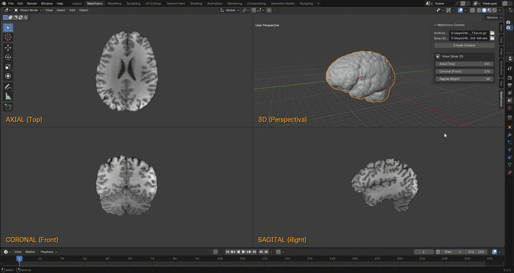

# Research_Blender_MedVisor

MedVision es un **orquestador de software médico** para el análisis de Resonancias Magnéticas (MRI) que coordina varias herramientas neurocientíficas especializadas (HD-BET, FSL FAST, SIENAX, SIENA) bajo una interfaz única. Tiene dos modos de uso:

- **Modo Headed** (add-on de Blender): aísla el cerebro con IA, clasifica sus tejidos y genera un entorno clínico interactivo — una malla 3D sincronizada con visores ortogonales 2D — para inspeccionar y discutir clínicamente un caso concreto.
- **Modo Headless** (script de línea de comandos): procesa resonancias en lote sin abrir Blender, pensado para análisis masivo, integración en otros sistemas, o generación automática de informes.

Ambos modos comparten el mismo pipeline de base (HD-BET + FSL), pero el Headless añade medidas estadísticas (volumen normalizado con SIENAX, atrofia longitudinal con SIENA) orientadas a la detección de anomalías.

## Prerrequisitos del Sistema

Este proyecto utiliza una arquitectura de procesamiento híbrida. Dado que Blender opera en Windows pero las herramientas neurocientíficas más robustas son nativas de entornos UNIX, MedVision actúa como puente entre ambos sistemas. Se necesita:

1. **HD-BET (Windows):** La IA encargada de la extracción craneal (skull-stripping).
2. **WSL (Windows Subsystem for Linux):** El subsistema integrado de Windows. Actúa como puente para ejecutar comandos nativos de Linux de forma transparente, tanto desde Blender como desde el script Headless.
3. **FSL (Linux / WSL):** El motor estadístico utilizado para segmentar los tejidos (`FAST`) y calcular volúmenes normalizados (`SIENAX`) o atrofia longitudinal (`SIENA`). Instálalo con el instalador oficial:
   ```bash
   wget https://fsl.fmrib.ox.ac.uk/fsldownloads/fslinstaller.py
   python3 fslinstaller.py
   ```
   Asegúrate de que `$FSLDIR/bin` quede en el `PATH` de tu `~/.bashrc` (el instalador te lo indica al finalizar).

### Dependencias de Python e IA

Para que HD-BET funcione correctamente, es requisito indispensable contar con **PyTorch**. Ten en cuenta que estas librerías de IA suelen ir un paso por detrás del desarrollo de software general, por lo que **no admiten las versiones más recientes de Python**. Asegúrate de instalarlo utilizando una versión de Python compatible y estable.

1. Instala la herramienta ejecutando: `pip install hd-bet` (asegurándote de tener PyTorch configurado previamente) o siguiendo las instrucciones de su repositorio oficial.
2. Anota la ruta completa donde se encuentra el ejecutable `hd-bet` (ej. `C:\Ruta\A\Tu\Python\Scripts\hd-bet.exe`).

> **Nota:** Si dispones de una GPU compatible con PyTorch (mediante CUDA), el procesamiento tardará menos. En caso de usar CPU, el proceso puede tardar unos minutos. Para más detalles, consulta el [repositorio oficial de HD-BET](https://github.com/MIC-DKFZ/hd-bet).

Para el modo Headless necesitas además:

```bash
pip install nibabel numpy
```

(`argparse` y `configparser` son parte de la librería estándar de Python, no requieren instalación.)

---

## Modo Headed: Add-on de Blender

*Importante: Este addon ha sido desarrollado y validado para funcionar a partir de la versión **3.6** de Blender.*

### Instalación

1. Descarga el código de este repositorio como un archivo `.zip`.
2. Abre Blender.
3. Dirígete a **Edit > Preferences > Add-ons**.
4. Haz clic en **Install...** y selecciona el archivo `.zip`.
5. Activa la casilla `3D View: MedVision` para habilitarlo.

### Uso

Una vez activado, el addon configurará el entorno automáticamente:

1. El sistema creará un espacio de trabajo (*Workspace*) dedicado llamado **MedVision**, configurado automáticamente con vista cuádruple (*QuadView*) para análisis clínico simultáneo.
2. En el panel lateral derecho del *Viewport* (tecla `N`), busca la pestaña **MedVision Control**.
3. **Archivo MRI:** Utiliza el selector para elegir tu volumen en formato `.nii.gz`.
4. **Ruta HD-BET:** Indica la ruta completa al ejecutable de `hd-bet` que instalaste en tu sistema.
5. **Extraer Cerebro:** Haz clic en este botón. Blender ejecutará el proceso en segundo plano, segmentará el parénquima cerebral y renderizará la malla tridimensional centrada y orientada automáticamente en el centro de la escena.
6. Utiliza el nuevo selector Capa FSL para alternar interactivamente la visualización entre Materia Gris, Materia Blanca o Líquido Cefalorraquídeo.



---

## Modo Headless: CLI (`headless.py`)

Pensado para procesar resonancias sin interacción manual: análisis en lote, integración en un servidor, o ejecución automática desde otro script. Funciona mediante dos subcomandos, porque **SIENAX** (análisis transversal: un paciente, un momento) y **SIENA** (análisis longitudinal: mismo paciente, dos fechas) necesitan tipos de entrada distintos.

### Configuración

Crea un archivo `config.ini` en la raíz del proyecto con las rutas de tu sistema que no cambian de paciente a paciente:

```ini
[Rutas]
hdbet = C:\Ruta\A\Tu\Python\Scripts\hd-bet.exe
```

### Uso: Análisis Transversal

Procesa un archivo o una carpeta entera de resonancias, calculando volúmenes absolutos (GM/WM/CSF vía FSL FAST) y, opcionalmente, el volumen normalizado (SIENAX):

```bash
python headless.py -o ./salida -c config.ini t -i ./carpeta_con_resonancias --sienax
```

- `-i` acepta tanto un único archivo `.nii.gz` como una carpeta con varios.
- `--sienax` es opcional; sin él, solo se calculan los volúmenes absolutos vía FAST.
- El script filtra automáticamente las secuencias que no sean T1 (lee los metadatos `.json` tipo BIDS si existen, o el nombre del archivo como respaldo), para no procesar por error una T2 o FLAIR.

### Uso: Análisis Longitudinal

Compara dos resonancias del mismo paciente en fechas distintas para medir atrofia cerebral (SIENA):

```bash
python headless.py -o ./salida -c config.ini l --a ./sub-0050_ses-01_T1w.nii.gz --r ./sub-0050_ses-02_T1w.nii.gz
```

- `--a` es la resonancia de la sesión más antigua; `--r`, la más reciente.
- El resultado principal es el **PBVC** (Porcentaje de Cambio de Volumen Cerebral): SIENA coregistra ambas imágenes y mide el desplazamiento físico de los contornos cerebrales entre ambas fechas, en vez de restar dos volúmenes absolutos calculados por separado — esto evita arrastrar el ruido estocástico propio de FAST (ver nota técnica más abajo).

### Informe generado

Cada ejecución produce dos salidas, calculadas una sola vez y compartidas entre ambas:

- **`informe_volumetrico_medvision.json`** — base de datos acumulativa. No se sobrescribe entre ejecuciones: cada paciente nuevo se añade, y cada sesión o comparación longitudinal nueva de un paciente existente se incorpora a su entrada. Estructura:
  ```json
  {
    "metadata": { "fecha_creacion_bd": "...", "herramientas": "..." },
    "pacientes": {
      "sub-0050": {
        "sesiones": {
          "ses-01": {
            "fecha_adquisicion": "...",
            "volumenes_absolutos_mm3": { "materia_gris": ..., "materia_blanca": ..., "liquido_cefalorraquideo": ..., "volumen_intracraneal_total": ... },
            "volumenes_sienax_normalizados": { "v_scale": ..., "volumen_cerebral_total_normalizado": ... }
          }
        },
        "comparaciones_longitudinales": {
          "ses-01_vs_ses-02": { "pbvc_porcentaje": ... }
        }
      }
    }
  }
  ```
- **`informe_<modo>_<timestamp>.html`** — informe autocontenido (un único archivo, sin dependencias externas) de la ejecución actual, con los datos calculados y las imágenes de segmentación que SIENA/SIENAX ya generan, incrustadas directamente.

---

## Arquitectura y Funcionamiento Interno

### Pipeline compartido (Headed y Headless)

1. **Ingesta y Segmentación:** Se invoca el ejecutable de `HD-BET` para aislar el tejido cerebral del cráneo.
2. **Segmentación de tejidos (FSL FAST vía WSL):** Un comando puente entra a Linux y calcula las Estimaciones de Volumen Parcial (PVE), separando probabilísticamente materia gris, materia blanca y líquido cefalorraquídeo mediante modelos de Markov.

> **Nota técnica — variabilidad entre ejecuciones:** FAST puede dar volúmenes ligeramente distintos (variaciones &lt;0.001%) entre ejecuciones consecutivas sobre la misma imagen. El algoritmo de inferencia (EM/ICM sobre Campos Aleatorios de Markov) es determinista; la variabilidad proviene de la inicialización por k-means y del no determinismo de la aritmética de coma flotante en operaciones multihilo. Es clínicamente irrelevante para métricas transversales, pero es la razón por la que las medidas longitudinales (atrofia) se calculan con SIENA — que mide directamente el desplazamiento del contorno cerebral coregistrado entre dos fechas, no la resta de dos volúmenes absolutos — en vez de restar dos resultados de FAST.

### Modo Headed (exclusivo)

3. **Reconstrucción 3D:** Se aplica el algoritmo de *Marching Cubes* sobre los vóxeles indexados para extraer la superficie cerebral y transformarla en una malla de vértices nativa de Blender.
4. **Renderizado 2D (GPU):** Las lonchas bidimensionales correspondientes a los planos Axial, Coronal y Sagital se extraen de la matriz de NumPy en tiempo real. Mediante el módulo `gpu` de Blender, se inyectan como texturas directamente en el búfer de dibujo de la gráfica (`draw_handler`).
   * Un lienzo opaco inteligente oculta de forma óptica la geometría 3D en las vistas ortogonales (`TOP`, `FRONT`, `RIGHT`), permitiendo inspeccionar las radiografías limpias y con un HUD de texto superpuesto mientras el modelo 3D permanece visible únicamente en la vista de perspectiva.

### Modo Headless (exclusivo)

3. **Análisis transversal (SIENAX):** Normaliza el volumen cerebral según el tamaño de la cabeza del paciente, permitiendo comparar sujetos distintos entre sí a partir de una sola resonancia.
4. **Análisis longitudinal (SIENA):** Coregistra dos resonancias del mismo paciente en fechas distintas y mide el Porcentaje de Cambio de Volumen Cerebral (PBVC), el indicador estándar de atrofia en el seguimiento de patologías como el Alzheimer.
5. **Persistencia:** Cálculo y renderizado de salida están desacoplados — el resultado se calcula una única vez y se vuelca tanto a la base de datos JSON acumulativa como a un informe HTML autocontenido, sin relanzar ningún subproceso de FSL/HD-BET por generar un formato adicional.

---

## Reconocimientos y Herramientas de Terceros

Este proyecto es posible gracias a la integración y el uso de herramientas especializadas de código abierto dentro de la comunidad científica y médica. Se otorga el correspondiente reconocimiento a:

* **[HD-BET (High-Definition Brain Extraction Tool)](https://github.com/MIC-DKFZ/HD-BET):** Desarrollado por el departamento de *Medical Image Computing* del DKFZ (Centro Alemán de Investigación Oncológica). MedVision utiliza este algoritmo de última generación basado en redes neuronales convolucionales (U-Net artificiales) para realizar la extracción craneal automatizada con precisión clínica.
* **[FSL](https://fsl.fmrib.ox.ac.uk/fsl/docs/):** Desarrollado por la Universidad de Oxford. Su módulo **FAST** rige el modelado estadístico y la separación tisular; **SIENAX** y **SIENA** proporcionan las medidas de volumen normalizado y atrofia longitudinal usadas en el modo Headless.
* **[SimpleITK (Insight Segmentation and Registration Toolkit)](https://simpleitk.org/):** Utilizado en el modo Headed para la manipulación de imágenes médicas y el procesamiento de los metadatos de orientación espacial de los archivos NIfTI.
* **[NiBabel](https://nipy.org/nibabel/):** Utilizado en el modo Headless para leer los mapas de probabilidad (PVE) generados por FSL FAST y calcular los volúmenes tisulares reales en mm³.
* **[NumPy](https://numpy.org/):** Utilizado para la gestión matricial de alta velocidad de los vóxeles tridimensionales, tanto en la reconstrucción 3D del modo Headed como en el cálculo de volúmenes del modo Headless.

## Limitaciones y Alcance

* **Modalidad:** Pipeline validado exclusivamente para volúmenes de **Resonancia Magnética (MRI)**, específicamente secuencias **T1**. El modo Headless descarta automáticamente secuencias T2/FLAIR detectadas por metadatos o nombre de archivo.
* **Formatos incompatibles:** El uso de datos basados en densidad radiológica, como la Angiotomografía (CTA) o PET, no es compatible con el modelo de segmentación actual.
* **SIENA (longitudinal):** Requiere obligatoriamente dos resonancias del mismo paciente en fechas distintas; si el posicionamiento de la cabeza entre sesiones es muy dispar, el registro espacial (FLIRT) puede requerir intervención manual.
* **Dependencia de WSL:** Tanto FAST como SIENAX/SIENA se ejecutan a través de WSL desde Windows. Si la variable de entorno `PATH` de tu distro WSL no carga FSL correctamente, revisa que `$FSLDIR` esté bien exportado en tu `~/.bashrc`.
